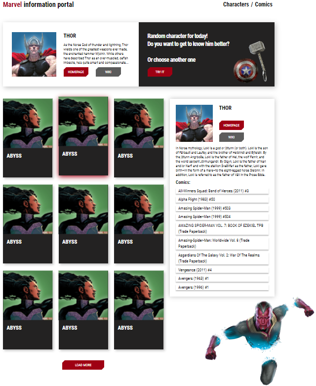

# Информационный портал по вселенной Marvel

  

## Используемые технологии

<table>
  <tr>
    <td align="center" valign="middle">
			
<b>HTML</b>

			
    </td>
    <td align="center" valign="middle">
			
<b>SCSS</b>

			
    </td>
    <td align="center" valign="middle">
			
<b>React</b>

			
    </td>
    <td align="center" valign="middle">
			
<b>Webpack</b>

			
    </td>
	</tr>
</table>

## Обо мне

__[Мое резюме](https://drive.google.com/file/d/14yiTD0I1NH9CG0S71qGibgLLRFwRvPXc/view?usp=sharing)__

__Привет, меня зовут Андрей. Я начинающий Frontend developer из Беларуси. Занимаюсь разработкай сайтов и веб-приложений, их адаптацией. В мои профессиональные компетенции входят знания по:__

<table>
  <tr>
    <td align="center" valign="middle">
			
<b>HTML</b>

			
    </td>
    <td align="center" valign="middle">
			
<b>CSS</b>

			
    </td>
    <td align="center" valign="middle">
			
<b>JavaScript</b>

			
    </td>
    <td align="center" valign="middle">
			
<b>React</b>

			
    </td>
    <td align="center" valign="middle">
			
<b>jQuery</b>

			
    </td>
	</tr>
  <tr>
    <td align="center" valign="middle">
			
<b>ООП</b>

			
    </td>
    <td align="center" valign="middle">
			
<b>JSON</b>

			
    </td>
    <td align="center" valign="middle">
			
<b>AJAX</b>

			
    </td>
    <td align="center" valign="middle">
			
<b>ES6</b>

			
    </td>
    <td align="center" valign="middle">
			
<b>Git</b>

			
    </td>
	</tr>
  <tr>
    <td align="center" valign="middle">
			
<b>Webpack</b>

			
    </td>
    <td align="center" valign="middle">
			
<b>Gulp</b>

			
    </td>
    <td align="center" valign="middle">
			
<b>Bootstrap</b>

			
    </td>
    <td align="center" valign="middle">
			
<b>BEM</b>

			
    </td>
    <td align="center" valign="middle">
			
<b>SASS/SCSS</b>

			
    </td>
	</tr>
  <tr>
    <td align="center" valign="middle">
			
<b>Less</b>

			
    </td>
    <td align="center" valign="middle">
			
<b>Babel</b>

			
    </td>
    <td align="center" valign="middle">
			
<b>Figma</b>

			
    </td>
    <td align="center" valign="middle">
			
<b>Adobe PhotoShop</b>

			
    </td>
    <td align="center" valign="middle">
			
<b>VS Code</b>

			
    </td>
	</tr>
</table>

 __Мои контакты:__ 
 - e-mail: Andreykovaleu@gmail.com
 - LinkedIn: [Andrey Kovaleu](https://www.linkedin.com/in/andrey-kovaleu)
 
 __Давайте работать вместе 😊__