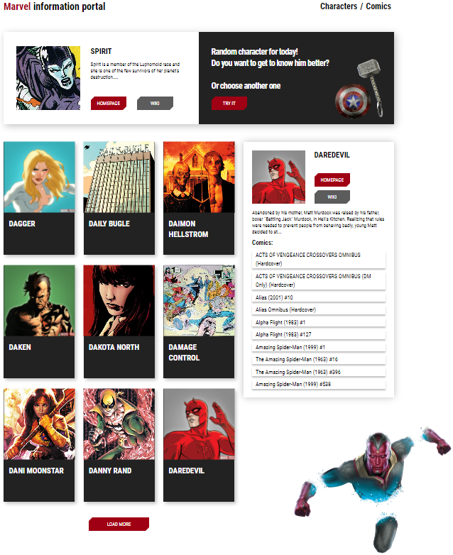

# Marvel information portal

  

## Technologies used

<table>
  <tr>
    <td align="center" valign="middle">
			
<b>HTML</b>

			
    </td>
    <td align="center" valign="middle">
			
<b>SCSS</b>

			
    </td>
    <td align="center" valign="middle">
			
<b>React</b>

			
    </td>
    <td align="center" valign="middle">
			
<b>Webpack</b>

			
    </td>
	</tr>
</table>

## About me

__[My resume](https://drive.google.com/file/d/1CHg2_egSXBX_sktrD0TLtaI4Zti84G1k/view?usp=sharing)__

__Hi, My name's Andrey. I'm a beginner Frontend developer from Belarus. I'm engaged in the development of websites and web applications, their adaptation. My professional skills include knowledge of:__

<table>
  <tr>
    <td align="center" valign="middle">
			
<b>HTML</b>

			
    </td>
    <td align="center" valign="middle">
			
<b>CSS</b>

			
    </td>
    <td align="center" valign="middle">
			
<b>JavaScript</b>

			
    </td>
    <td align="center" valign="middle">
			
<b>React</b>

			
    </td>
    <td align="center" valign="middle">
			
<b>jQuery</b>

			
    </td>
	</tr>
  <tr>
    <td align="center" valign="middle">
			
<b>ООП</b>

			
    </td>
    <td align="center" valign="middle">
			
<b>JSON</b>

			
    </td>
    <td align="center" valign="middle">
			
<b>AJAX</b>

			
    </td>
    <td align="center" valign="middle">
			
<b>ES6</b>

			
    </td>
    <td align="center" valign="middle">
			
<b>Git</b>

			
    </td>
	</tr>
  <tr>
    <td align="center" valign="middle">
			
<b>Webpack</b>

			
    </td>
    <td align="center" valign="middle">
			
<b>Gulp</b>

			
    </td>
    <td align="center" valign="middle">
			
<b>Bootstrap</b>

			
    </td>
    <td align="center" valign="middle">
			
<b>BEM</b>

			
    </td>
    <td align="center" valign="middle">
			
<b>SASS/SCSS</b>

			
    </td>
	</tr>
  <tr>
    <td align="center" valign="middle">
			
<b>Less</b>

			
    </td>
    <td align="center" valign="middle">
			
<b>Babel</b>

			
    </td>
    <td align="center" valign="middle">
			
<b>Figma</b>

			
    </td>
    <td align="center" valign="middle">
			
<b>Adobe PhotoShop</b>

			
    </td>
    <td align="center" valign="middle">
			
<b>VS Code</b>

			
    </td>
	</tr>
</table>

 __My contacts:__ 
 - e-mail: Andreykovaleu@gmail.com
 - LinkedIn: [Andrey Kovaleu](https://www.linkedin.com/in/andrey-kovaleu)
 
 __Let's work together 😊__